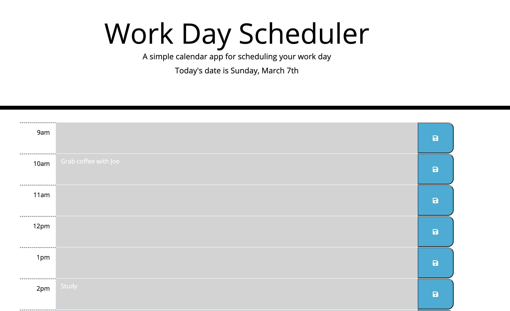

# Work Day Scheduler

This application helps busy individuals manage their schedules on a daily basis. They are given the current day and below that they are shown a calendar that breaks down their work day by the hour. Within each hour block, the user can fill in the event or task that they need to do. You can visit the deployed application [here](https://squidbeaks.github.io/work-day-scheduler/).
 
